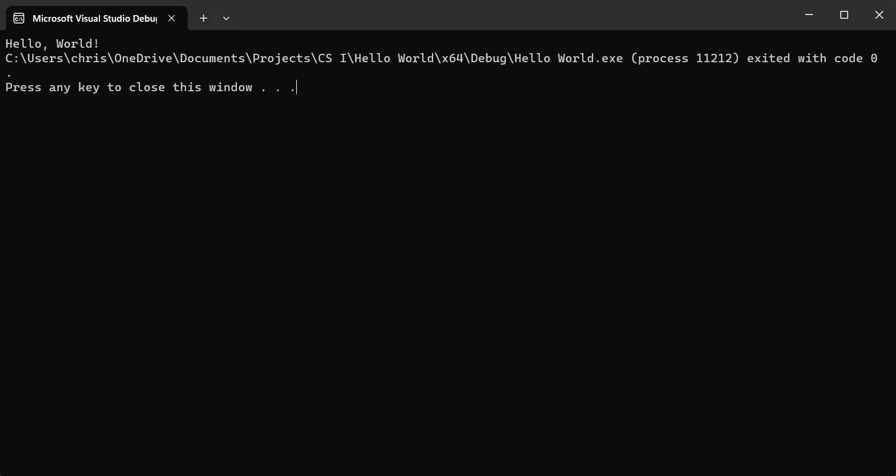

# **CS30001- CS I Prog.. and Problem Solving**

**Lab 1: Hello World**

Lab Report

# Christian Auman

# January 19, 2024

#

Introduction:

This lab was to explain the process of installing Visual Studio, and creating a basic Hello World program in c++. This lab should provide a basic hello world program where the program prints "Hello, World!" to the console. This program should use \<iostream\> for the input and output. The other purpose of this lab was to learn how to write a lab report.

Software Design Methodology:

Highlight the thinking behind your software design. The most simplified version of this could be your procedure and why you chose that procedure. In most cases, you will include a discussion on the decisions you made for your software design (before you started writing the actual code). Primarily, you will be justifying why you chose to implement your solution in a certain way. (Typical Length: 2-4 paragraphs)

_Software design is "What exactly did I do, Why did I do it this way, why my way is better"_

Results:

Results are required and a written description of your results is needed. Caption all figures and tables included and number them properly. (Typical Length: 2-3 sentences per result)

_Results are "When I ran the code, here is what happened"_

Conclusion and Discussion:

The results are analyzed for meaning and the significance here. You can include all problems faced; lessons learned and can answer any given questions here. (Typical Length: 1-2 paragraphs)

_Conclusion is "Here is why I think it happened"_

Appendix A

Include any source code here.
